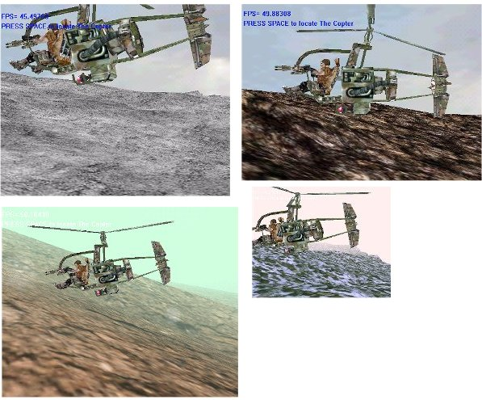



## JohnaDX7 engine beta 1\.03 the new relaese of my 3d engine it deserves your attention

### Description

This demo of my 3D engine

show new capabilities like

any Quake2 MD2 and MDL halflife object can be loaded and animated

New 3D sound engine complete rebuilt

This demo show a land scene with and Helicopter flying over the landscape scene.

I'm waiting for your feedbacks and your votes.
 
### More Info
 

             |
---                |---
**Submitted On**   |2002-01-30 15:01:28
**By**             |[polaris](https://github.com/Planet-Source-Code/PSCIndex/blob/master/ByAuthor/polaris.md)
**Level**          |Advanced
**User Rating**    |4.4 (44 globes from 10 users)
**Compatibility**  |VB 5\.0, VB 6\.0
**Category**       |[DirectX](https://github.com/Planet-Source-Code/PSCIndex/blob/master/ByCategory/directx__1-44.md)
**World**          |[Visual Basic](https://github.com/Planet-Source-Code/PSCIndex/blob/master/ByWorld/visual-basic.md)
**Archive File**   |[JohnaDX7\_e518071302002\.zip](https://github.com/Planet-Source-Code/polaris-johnadx7-engine-beta-1-03-the-new-relaese-of-my-3d-engine-it-deserves-your-attenti__1-31305/archive/master.zip)

